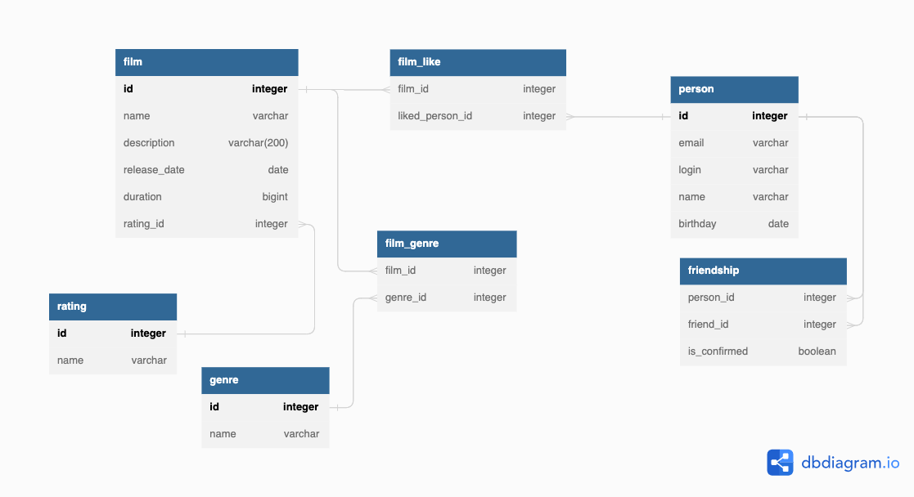

***Java Filmorate project***

***Filmorate*** - это бэкэнд-сервис на основе Restful API для хранения и управления информацией о фильмах(название, рейтинг MPA, жанр, описание и продолжительность), составления рейтинга фильмов на основе отзывов пользователей, поиска фильма, а также для общения пользователей.

***Стек:***

- Java 11
- Spring Boot
- Lombok
- Maven
- Junit
- JDBC
- SQL
- H2
  
***Функциональность::***

 - Получение фильма по id
 - Получение списка всех фильмов
 - Получение списка наиболее популярных фильмов
 - Создание/редактирование/удаление профилей пользователей
 - Получение списка всех пользователей
 - Добавление пользователей в друзья, возможность рекомендовать фильм друг другу
 - Получение списка друзей пользователя
 - Получение списка общих друзей между двумя пользователями
 - Получение списка рейтингов MPA, получения рейтинга по id
 - Получение списка жанров, получение жанра по id
 - Возможность поставить/удалить лайк фильму
   
## ER diagram:

Query examples:

DELETE FROM film_like 
WHERE film_id = 1 AND liked_person_id = 3;

SELECT * FROM genre;

SELECT COUNT(*) FROM rating;

INSERT INTO person (email, login, name, birthday)
VALUES('test@ya.ru', 'cattt', 'Murzik', '2000-09-09');
